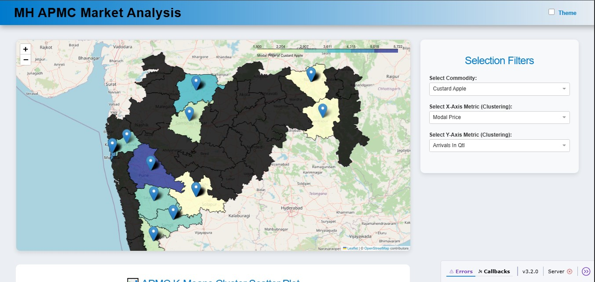
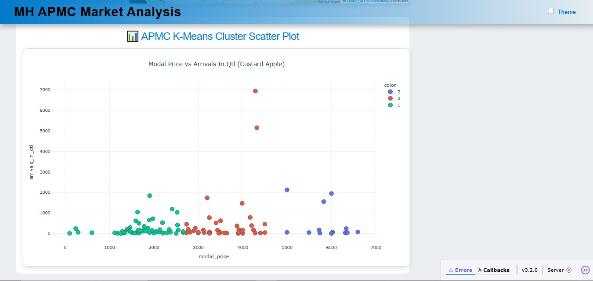

Perfect 👍 — I see your **project structure** from the screenshot. Based on it, here’s the updated and accurate `README.md` for your **APMC Market Analysis (Streamlit-based)** project:

---

```markdown
# 🏪 APMC Market Analysis

## 📘 Project Overview
The **APMC Market Analysis** project analyzes market trends, commodity prices, and regional trading data from Agricultural Produce Market Committees (APMCs).  
Using **Streamlit**, this project provides an interactive dashboard for exploring insights about agricultural markets across Maharashtra.

---

## 🎯 Objectives
- Analyze commodity price fluctuations and patterns.  
- Visualize market data with interactive dashboards.  
- Study district-wise variations in agricultural trends.  
- Provide insights to help farmers, traders, and policymakers.

---

## 🛠️ Technologies Used
- **Python**  
- **Streamlit**  
- **Pandas**  
- **Matplotlib / Seaborn**  
- **GeoJSON** (for district mapping)  
- **CSS** (for custom styling)

---

## 📂 Project Structure
```

APMC-Market-Analysis/
│
├── .vscode/settings.json         # VS Code settings
├── app.py                        # Main Streamlit application entry point
│
├── app/                          # Streamlit app modules
│   ├── layout.py                 # Layout and page structure
│   ├── callbacks.py              # Interactive callbacks and events
│   └── **pycache**/              # Compiled cache files
│
├── assets/                       # Static assets (CSS, images, etc.)
│   └── style.css                 # Custom Streamlit styling
│
├── data/                         # Input datasets
│   ├── data.csv                  # APMC market data
│   └── maharashtra_districts.geojson  # Geographical data for mapping
│
├── models/                       # ML or clustering models
│   └── clustering.py
│
├── src/                          # Core processing and visualization modules
│   ├── utils.py                  # Helper functions
│   └── visualization.py          # Graph and plot generation
│
├── requirements.txt              # Dependencies
└── README.md                     # Project documentation (this file)

````

---

## 🖥️ Features
- 📊 **Interactive Dashboard** built with Streamlit  
- 🗺️ **District-level Visualization** using GeoJSON  
- 📈 **Trend and Price Analysis** for key commodities  
- 🤖 **Clustering Model** for regional comparison  
- 🎨 **Custom Styled UI** with `assets/style.css`  

---

## 📊 Output Visualizations

Below are sample visualizations (stored in the `output/` folder):




> 💡 *Ensure your output images are placed inside the `output/` folder with the same filenames as above.*

---

## 🚀 How to Run the Project

1. **Clone the repository**
   ```bash
   git clone https://github.com/<your-username>/APMC-Market-Analysis.git
   cd APMC-Market-Analysis
````

2. **Install dependencies**

   ```bash
   pip install -r requirements.txt
   ```

3. **Run the Streamlit app**

   ```bash
   streamlit run app.py
   ```

4. Open the URL displayed in your terminal (usually `http://localhost:8501`).

---

## 📌 Future Enhancements

* Integrate real-time APMC data APIs.
* Add predictive analytics for price forecasting.
* Deploy online via Streamlit Cloud or Render.
* Include comparison charts for multiple commodities.

---

## 👨‍💻 Author

**Chaitanya Dinesh Dhayarkar**
*Vivekanand College, Chembur*
💼 IT Student | Data & Web Enthusiast

---

## 📄 License

This project is licensed under the **MIT License**.

---

🌾 *“Empowering farmers through data-driven insights.”* 🌾

```

